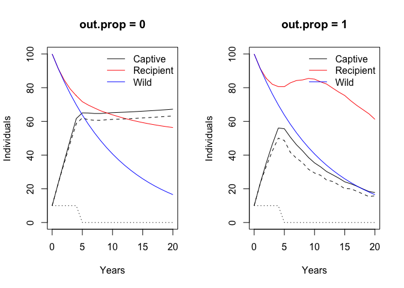

# CaribouBC

> Caribou Population Forecasting

[](https://travis-ci.org/psolymos/CaribouBC)
[](https://codecov.io/gh/psolymos/CaribouBC)

Try the [Shiny app](https://psolymos.shinyapps.io/CaribouBC/) or run
locally as `shiny::runGitHub("bcgov/CaribouBC", subdir =
"inst/shiny/matpen")`.


## Installation

Stable version:

``` r
remotes::install_github("bcgov/CaribouBC")
```

Development version is available as this fork:

``` r
remotes::install_github("psolymos/CaribouBC")
```

See user visible changes in the [NEWS](NEWS.md) file.

## Usage

``` r
library(CaribouBC)
#> Loading required package: popbio
#> CaribouBC 0.2.1   2019-10-10

## Predefined settings
(s1 <- caribou_settings("mat.pen"))
#> Caribou settings - pen type: mat.pen 
#> 
#>  - c.surv.wild   :0.163
#>  - c.surv.capt   :0.54
#>  - f.surv.wild   :0.853
#>  - f.surv.capt   :0.903
#>  - f.preg.wild   :0.92
#>  - f.preg.capt   :0.92
#>  - pen.cap       :35
#>  - pen.cost.setup:500
#>  - pen.cost.proj :80
#>  - pen.cost.maint:300
#>  - pen.cost.capt :250
#>  - pen.cost.pred :0
(s2 <- caribou_settings("pred.excl"))
#> Caribou settings - pen type: pred.excl 
#> 
#>  - c.surv.wild   :0.163
#>  - c.surv.capt   :0.72
#>  - f.surv.wild   :0.853
#>  - f.surv.capt   :0.95
#>  - f.preg.wild   :0.92
#>  - f.preg.capt   :0.92
#>  - pen.cap       :35
#>  - pen.cost.setup:1868
#>  - pen.cost.proj :80
#>  - pen.cost.maint:600
#>  - pen.cost.capt :200
#>  - pen.cost.pred :80

## Modifying predefined settings
caribou_settings("mat.pen", c.surv.capt=0.65, pen.cap=30)
#> Caribou settings - pen type: mat.pen 
#> 
#>  - c.surv.wild   :0.163
#>  - c.surv.capt   :0.65
#>  - f.surv.wild   :0.853
#>  - f.surv.capt   :0.903
#>  - f.preg.wild   :0.92
#>  - f.preg.capt   :0.92
#>  - pen.cap       :30
#>  - pen.cost.setup:500
#>  - pen.cost.proj :80
#>  - pen.cost.maint:300
#>  - pen.cost.capt :250
#>  - pen.cost.pred :0

## Forecast based on settings for 75% females penned
f1 <- caribou_forecast(s1, fpen.prop = 0.75)
f2 <- caribou_forecast(s2, fpen.prop = 0.75)

## Most important results summarized
summary(f1)
#> Caribou forecast - pen type: mat.pen 
#> 
#>  - tmax     :20
#>  - pop.start:100
#>  - fpen.prop:0.75
#> 
#>  - npens      :5
#>  - lam.pen    :1.02
#>  - lam.nopen  :0.914
#>  - Nend.nopen :17
#>  - Nend.pen   :163
#>  - Nend.diff  :146
#>  - Cost.total :56
#>  - Cost.percap:0.384
summary(f2)
#> Caribou forecast - pen type: pred.excl 
#> 
#>  - tmax     :20
#>  - pop.start:100
#>  - fpen.prop:0.75
#> 
#>  - npens      :16
#>  - lam.pen    :1.09
#>  - lam.nopen  :0.914
#>  - Nend.nopen :17
#>  - Nend.pen   :556
#>  - Nend.diff  :539
#>  - Cost.total :192
#>  - Cost.percap:0.356

## Plot the results
plot(f2)
lines(f1, col = 2)
legend("topleft", col = c(1,1,2), lty = c(2,1,1),
    legend = c("No pen", "Mat pen", "Pred excl"))
```

<!-- -->

``` r

## Find 'breakeven' proportion of females penned where lambda=1
(b1 <- caribou_breakeven(f1, lambda = 1))
#> [1] 0.5669914
(b2 <- caribou_breakeven(f2, lambda = 1))
#> [1] 0.3441178
f3 <- caribou_forecast(s1, fpen.prop = b1)
f4 <- caribou_forecast(s2, fpen.prop = b2)
## See that lines are truly flat
op <- par(mfrow = c(1, 2))
plot(f3, main = "Mat pen")
plot(f4, main = "Pred excl")
```

<!-- -->

``` r
par(op)

## Forecast using number of penned females
## - it can be an initial number
## - or a vector of individuals for subsequent years
caribou_forecast(s1, fpen.inds = 5)
#> Caribou forecast - pen type: mat.pen 
#> 
#>  - tmax     :20
#>  - pop.start:100
#>  - fpen.inds:5
caribou_forecast(s2, fpen.inds = c(5, 0, 4, 6))
#> Caribou forecast - pen type: pred.excl 
#> 
#>  - tmax     :20
#>  - pop.start:100
#>  - fpen.inds:5 0 4 6

## Create projection matrices
s <- caribou_settings()
caribou_matrix(s, wild=TRUE)  # wild
#>         [0,1) [1,2) [2,3) [3,Inf]
#> [0,1)   0.000 0.000 0.000 0.39238
#> [1,2)   0.163 0.000 0.000 0.00000
#> [2,3)   0.000 0.853 0.000 0.00000
#> [3,Inf] 0.000 0.000 0.853 0.85300
caribou_matrix(s, wild=FALSE) # captive
#>         [0,1) [1,2) [2,3) [3,Inf]
#> [0,1)    0.00 0.000 0.000 0.41538
#> [1,2)    0.54 0.000 0.000 0.00000
#> [2,3)    0.00 0.903 0.000 0.00000
#> [3,Inf]  0.00 0.000 0.903 0.90300

## Compare scenarios for captive breeding
## out.prop = 0: move only N[t]-in.max youngs
x0 <- caribou_breeding(s,
    age.cens = 18,    # proj matrix censored at this age
    tmax = 20,        # projection horizon
    in.age = c(3, 4), # 5x 3yr + 5x 4yr female --> captive
    in.inds = c(5, 5),
    in.max = 60,      # capacity of breeding facility
    out.age = c(1, 2),# 1 and 2yr calves --> recipient
    out.prop = 0)
x0
#> Caribou captive breeding:
#> 
#>  - tmax     :20
#>  - pop.start:100
#>  - in.max   :60
#>  - out.prop :0
#> 
#>  Ncapt Nrecip  Nwild 
#>  59.56  54.76  16.54
summary(x0)
#>    Years Nin Nout    Ncapt    Nrecip     Nwild
#> 1      0  10    0 10.00000 100.00000 100.00000
#> 2      1  10    0 23.18380  91.39560  91.39560
#> 3      2  10    0 37.33182  83.53156  83.53156
#> 4      3  10    0 52.13296  76.34417  76.34417
#> 5      4   8    5 60.32740  74.77522  69.77522
#> 6      5   0    5 61.30754  73.03648  63.77148
#> 7      6   0    5 60.25846  71.85677  58.28433
#> 8      7   0    3 60.39753  69.48162  53.26931
#> 9      8   0    3 60.40149  67.38260  48.68581
#> 10     9   0    4 59.95943  66.17652  44.49669
#> 11    10   0    4 59.90962  64.75278  40.66802
#> 12    11   0    4 59.51499  63.76250  37.16878
#> 13    12   0    3 59.95682  61.87466  33.97063
#> 14    13   0    3 60.27493  60.20821  31.04766
#> 15    14   0    4 59.92817  59.38578  28.37620
#> 16    15   0    4 59.74541  58.58360  25.93460
#> 17    16   0    3 60.28610  57.14619  23.70308
#> 18    17   0    4 59.62999  56.89708  21.66357
#> 19    18   0    3 60.34917  55.31162  19.79955
#> 20    19   0    4 59.79264  55.20203  18.09592
#> 21    20   0    4 59.56152  54.76152  16.53888

## out.prop = 1: move all youngs and replace with females
x1 <- update(x0, out.prop = 1)

## Vicualize the 2 scenarios
op <- par(mfrow=c(1, 2))
plot(x0, main="out.prop = 0")
plot(x1, main="out.prop = 1")
```

<!-- -->

``` r
par(op)
```

## Getting Help or Reporting an Issue

To report bugs/issues/feature requests, please file an
[issue](https://github.com/bcgov/CaribouBC/issues/).

## How to Contribute

If you would like to contribute to the package, please see our
[CONTRIBUTING](CONTRIBUTING.md) guidelines.

Please note that this project is released with a [Contributor Code of
Conduct](CODE_OF_CONDUCT.md). By participating in this project you agree
to abide by its terms.

## License

    Copyright 2018 Province of British Columbia
    
    Licensed under the Apache License, Version 2.0 (the &quot;License&quot;);
    you may not use this file except in compliance with the License.
    You may obtain a copy of the License at
    
    http://www.apache.org/licenses/LICENSE-2.0
    
    Unless required by applicable law or agreed to in writing, software distributed under the License is distributed on an &quot;AS IS&quot; BASIS,
    WITHOUT WARRANTIES OR CONDITIONS OF ANY KIND, either express or implied.
    See the License for the specific language governing permissions and limitations under the License.

-----

*This project was created using the
[bcgovr](https://github.com/bcgov/bcgovr) package.*
